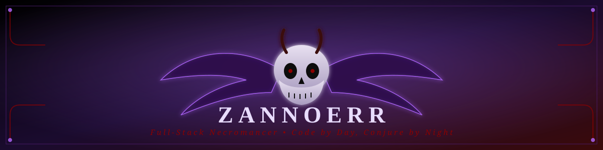

<div align="center">



<a href="#">
  
</a>

<br/>


&nbsp;


</div>

<br/>


<br/>

## 🕯️ &nbsp;The Grimoire (About Me)

```yaml
name: Zannoerr
alignment: Chaotic Good, mostly
class: Full-Stack Necromancer 🧙‍♂️
current_quest: summoning bugs into existence, then banishing them
weapon_of_choice: terminal + dark roast coffee ☕
guild: open source wanderers
motto: "ship it, then pray to the console gods"
```

Saya bukan sekadar developer — saya arsitek dunia digital yang lahir dari bayangan `//TODO` dan bangkit tiap malam demi satu `git push` lagi. Kalau kamu suka ngobrolin project, kolaborasi, atau sekadar bertukar mantra kode, **gerbang ini selalu terbuka**.

<br/>

## ⚔️ &nbsp;Arsenal & Artefak

<div align="center">


</div>

<br/>

## 🩸 &nbsp;Chronicle of Commits

<div align="center">
  
  
</div>

<div align="center">
  
</div>

<br/>

<div align="center">
  
</div>

<br/>

<div align="center">
  
</div>

<br/>


<br/>

## 🦇 &nbsp;Summon Me

<div align="center">

*"Whisper your message into the void — I always answer the call."*

<br/>

<table>
  <tr>
    <td align="center" width="120">
      <a href="https://linkedin.com/in/zannoerr">
        
        <br/><sub><b>LinkedIn</b></sub>
      </a>
    </td>
    <td align="center" width="120">
      <a href="https://www.instagram.com/beezcoft?stkn=Njg2bG55dmpiODRw">
        
        <br/><sub><b>Instagram</b></sub>
      </a>
    </td>
    <td align="center" width="120">
      <a href="https://x.com/zannoerr">
        
        <br/><sub><b>X</b></sub>
      </a>
    </td>
    <td align="center" width="120">
      <a href="mailto:zannoerr@gmail.com">
        
        <br/><sub><b>Email</b></sub>
      </a>
    </td>
    <td align="center" width="120">
      <a href="https://discord.com/users/zannoerr">
        
        <br/><sub><b>Discord</b></sub>
      </a>
    </td>
  </tr>
</table>

<br/>


</div>

<br/>

<div align="center">


*"Dalam kegelapan kode, aku menemukan cahaya logika."* 🕷️

</div>
